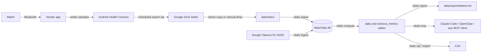

# wannabe-fit

Whoop-style recovery, strain, and sleep metrics from a cheap watch, computed on your own machine
from raw Android Health Connect exports. No cloud account, no subscription, no dashboard, no AI
inference. The output is a SQLite database, CSV dumps, Markdown reports, and an MCP server so that
Claude Code, OpenClaw, or any other agent can query your data.

Built for a CMF Watch Pro 2 that syncs through the Nothing X app. It works with any watch or app that
writes heart rate, sleep, and SpO2 into Health Connect: Samsung Health, Garmin Connect, Zepp,
Fitbit, Oura, Polar, Coros, and most budget wearables.



## Why this exists

Watches in the 50 to 100 dollar range collect the same raw signals as a Whoop band: continuous heart
rate, sleep stages, SpO2, steps. What they lack is the analysis layer, and their apps keep the raw
samples locked in. Health Connect changes that. Since Android 15 the phone can export its whole
Health Connect database as a zip on a daily schedule. Inside is one unencrypted SQLite file with
every sample every app ever wrote.

This tool reads that file and applies published sports-science formulas to it: Banister TRIMP,
Karvonen zones, the impulse-response fitness model, Keytel calorie estimation, sleep debt, and a
recovery score built from resting heart rate, sleep, and SpO2. Every number is reproducible from the
raw tables, every constant is in one file, and every formula is documented below.

The Google Fit REST API is not an option any more. Google closed it to new sign-ups in May 2024 and
ends it at the end of 2026. Health Connect exports are the durable path.

## What you get

A `daily` table with one row per local day:

| Group | Columns |
|---|---|
| Recovery | `recovery` (0-100), `recovery_band`, `rhr`, `rhr_method`, `rhr_base30`, `rhr_sd30`, `hrv_night_ms` when the watch provides it |
| Sleep | `sleep_start`, `sleep_end`, `sleep_tib_min`, `sleep_asleep_min`, `sleep_efficiency`, light/deep/REM/awake minutes, `sleep_need_min`, `sleep_performance`, `sleep_debt7_h`, `sleep_consistency` |
| Load | `strain` (0-21), `trimp`, `trimp_edwards`, zone minutes `z0`..`z5`, `ctl`, `atl`, `tsb`, `acwr` |
| Body | `spo2_night_mean`, `spo2_night_min`, `spo2_day_mean`, `weight_kg`, `vo2max_uth` |
| Activity | `steps`, `distance_km`, `kcal_hr`, `kcal_active_device`, `kcal_total_device` |
| Quality | `hr_samples`, `hr_minutes`, `hr_coverage_pct`, `hr_max_used` |

A `workout_metrics` table with one row per session: duration, average and peak HR, percent of HR
max, zone minutes, TRIMP, strain, HR-derived kcal next to the device kcal, and 1-minute heart-rate
recovery. Plus the raw tables underneath, so you can compute anything else yourself.

## Setup

Requirements: Python 3.12+, [uv](https://docs.astral.sh/uv/), an Android phone on Android 15 or
newer, and a watch whose app writes to Health Connect.

```bash
git clone https://github.com/devsrijit/wannabe-fit.git
cd wannabe-fit
uv sync
cp config.example.yaml config.yaml   # then edit: sex, birth year, weight, timezone
```

On the phone:

1. In the watch app, turn on 24/7 heart rate, SpO2, and sleep tracking. Pick the shortest heart-rate
   interval it offers. Make sure the app is allowed to write to Health Connect.
2. Settings > Security and privacy > Health Connect > Manage data > Export. Set a daily schedule and
   pick a Google Drive folder.

Get the zip to your computer. Either:

- Install [rclone](https://rclone.org), run `rclone config create gdrive drive scope=drive.readonly`,
  and set `rclone.remote_path: "gdrive:<your folder>"` in `config.yaml`. `vitals sync` then pulls the
  newest zip before every run. rclone's shared Google client is being retired during 2026, so create
  your own OAuth client ID as described in the [rclone docs](https://rclone.org/drive/#making-your-own-client-id).
- Or drop the zip into `data/inbox/` by any means. Any file name works.

Then:

```bash
uv run vitals doctor   # what the export contains, sample intervals, sources
uv run vitals sync     # pull, ingest, compute, write data/reports/latest.md
uv run vitals today    # the day card
```

If `doctor` shows a table the watch should fill but did not, the fix is in the watch app's settings.

### Run it in the background (macOS)

```bash
scripts/install-launchd.sh          # every 6 hours
scripts/install-launchd.sh 3600     # every hour
```

This installs a launchd agent named `com.wannabe-fit.sync` that runs `vitals sync` and logs to
`data/sync.log`. The sync is idempotent: re-ingesting the same export changes nothing, and rclone only
transfers the zip when it changed. On Linux, a cron line running `uv run --project <path> vitals sync`
does the same job.

## Interfaces

### Command line

| Command | What it does |
|---|---|
| `uv run vitals doctor [path]` | Inventory of an export and of the local db, sample gaps, last sync |
| `uv run vitals ingest [path]` | Load a Health Connect zip or db, or a Takeout Fit zip or folder. Default: newest file in `data/inbox` |
| `uv run vitals compute` | Recompute `daily` and `workout_metrics` |
| `uv run vitals sync` | rclone pull (if configured) + ingest + compute + report |
| `uv run vitals today` | The latest day card |
| `uv run vitals report --days 30` | Markdown report with daily and workout tables |
| `uv run vitals sql "select ..."` | Read-only SQL, CSV to stdout |
| `uv run vitals export DIR` | Every table as CSV |
| `uv run vitals schema` | The db schema |

### MCP server

`uv run vitals-mcp` starts a stdio MCP server with these tools: `get_daily`, `get_workouts`,
`get_sleep`, `get_heart_rate`, `run_sql` (read-only), `get_schema`, `get_report`, `sync`.

Register it in Claude Code:

```bash
claude mcp add --scope user vitals -- uv run --project /absolute/path/to/wannabe-fit vitals-mcp
```

Then ask things like "compare my sleep on training days and rest days this month" or "show my heart
rate during yesterday's run in 1-minute buckets". Any other MCP client takes the same command.

### Files

`data/vitals.db` is plain SQLite. `data/reports/latest.md` is always the current report. Both are
gitignored, as is `config.yaml`, so a fork of this repo never carries personal data.

## Tables

Raw tables keep epoch milliseconds in UTC. Zone offsets from Health Connect sit next to sessions.
`daily` uses the timezone from `config.yaml`. Sleep belongs to the day you woke up.

| Table | Content |
|---|---|
| `hr` | Every heart-rate sample: `ts`, `bpm`, `source` |
| `spo2`, `hrv`, `resp`, `rhr_device`, `weight`, `vo2_device` | Instant samples from the matching Health Connect tables |
| `steps`, `calories`, `distance` | Interval totals, per source |
| `sleep_sessions`, `sleep_stages` | Sessions and stage segments (1 awake, 4 light, 5 deep, 6 REM, 7 awake in bed) |
| `workouts` | Exercise sessions with the Health Connect type code, name, and source |
| `daily`, `workout_metrics` | Computed, rebuilt on every `compute` |

Several apps often write the same thing. Steps, calories, and distance take the largest single-source
total per day rather than the sum. Auto-detected sessions from Google Fit are kept unless they overlap a
session another app tracked for the same window. Both rules are configurable.

## Formulas

The constants live in `vitals/metrics.py`.

- **HR max**: `hr_max` in config, else Tanaka `208 - 0.7 * age`. Replace it with a measured peak when
  you have one. Every zone and strain number depends on it.
- **Resting HR** (`rhr`, `rhr_method`): lowest 15-minute mean of HR inside the main sleep session.
  Fallbacks in order: lowest 15-minute mean of the whole day, the device's resting HR record, the 5th
  percentile of the day.
- **Baselines**: `rhr_base30` and `rhr_sd30` are the trailing 30-day median and standard deviation,
  excluding today. Zones and TRIMP use `rhr_base30`, so one bad night does not move every zone boundary.
- **Zones**: Karvonen heart-rate-reserve fractions from `config.yaml`. z1 50-60%, z2 60-70%, z3 70-80%,
  z4 80-90%, z5 90-100%. Minutes come from each sample's gap to the next, capped at `hr_sample_cap_s`
  (default 10 min) in the background and at 60 s inside workouts.
- **TRIMP** (Banister 1991): `sum(minutes * f * 0.64 * e^(1.92 f))` for men, `0.86 * e^(1.67 f)` for
  women, where `f` is the heart-rate-reserve fraction. Only samples with `f >= 0.30` count; sedentary
  time carries no load. `trimp_edwards` is `sum(zone minutes * zone number)`.
- **Strain** (0-21): `21 * (1 - e^(-L / 155))` with `L = trimp_edwards`. Logarithmic like Whoop, so
  the last points are the hardest to earn. About 60 minutes in z5 gives 18. This is not Whoop's
  private formula.
- **HR calories** (`kcal_hr`, Keytel 2005): per minute, men
  `(-55.0969 + 0.6309 HR + 0.1988 kg + 0.2017 age) / 4.184`, only while `f >= 0.30`. Validated for
  steady aerobic work; it overstates strength sessions. The device number sits next to it.
- **Fitness, fatigue, form** (`ctl`, `atl`, `tsb`; Banister impulse-response): CTL is a 42-day
  exponential average of TRIMP, ATL a 7-day one, TSB is yesterday's CTL minus ATL. `acwr` is the 7-day
  mean over the 28-day mean; above 1.5 is the injury-risk zone in the literature.
- **Sleep**: `sleep_asleep_min` is the sum of light, deep, REM, and generic sleeping stages; time in bed
  is the session length. `sleep_need_min = base + 60 * (yesterday's strain / 21) + min(60, 0.5 * 7-day debt)`.
  `sleep_performance` is asleep over need, capped at 100. `sleep_consistency` loses 25 points for each
  hour of standard deviation in bed and wake times over 7 days.
- **Recovery** (0-100): `0.50 * RHR component + 0.35 * sleep performance + 0.15 * SpO2 component`.
  The RHR component is `70 - 20 * z`, where z is today's RHR against the 30-day baseline. The SpO2
  component maps the overnight minimum from 88% (0) to 95% (100). If HRV is present the weights become
  HRV 40, RHR 25, sleep 25, SpO2 10. Bands: green 67+, yellow 34-66, red below 34.
- **VO2max** (`vo2max_uth`, Uth 2004): `15.3 * HRmax / RHR`. A population estimate, for trend only.
- **Workout HR recovery** (`hrr_1min`): mean HR over the last 15 s of the session minus mean HR 50-75 s
  after it. Needs the watch to keep sampling after the workout ends. Above 20 bpm is good, below 12 poor.

## Adapting it

- **Another watch**: nothing to change if the app writes to Health Connect. Run `vitals doctor` on the
  export to see which tables are filled. If the watch provides HRV, recovery picks it up on its own.
- **Older history**: `vitals ingest` also reads a Google Takeout export of Google Fit (the zip or the
  `Fit/All Data` folder). Fit auto-detected walks arrive as workouts with source `Fit`.
- **Different formulas**: every constant is in `vitals/metrics.py`, and `compute` rebuilds the derived
  tables from raw samples, so changes apply to all history at once.
- **Testing without a phone**: `uv run python scripts/make_fixture.py /tmp/fixture.zip` builds a
  synthetic 35-day export in the real Health Connect layout. Ingest it from `/tmp`, never from
  `data/inbox`, or `sync` mixes synthetic rows into your real database.

## Limits

- Health Connect has no data type for vendor stress scores, so they do not export.
- Background HR interval is whatever the watch app allows. `doctor` prints the real median gap.
- Health Connect keeps 30 days of most data on the phone by default. Daily exports snapshot everything,
  so nothing is lost while the schedule runs.
- The recovery score without HRV leans on resting HR, sleep, and SpO2. It is a trend instrument, not
  a diagnosis.

## License

MIT.
